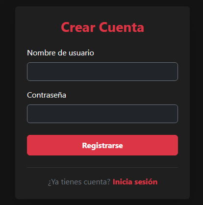
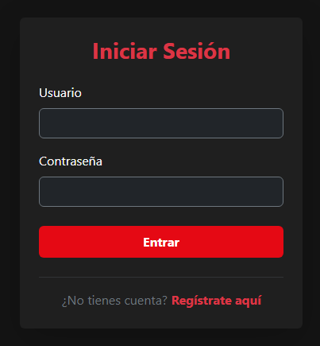
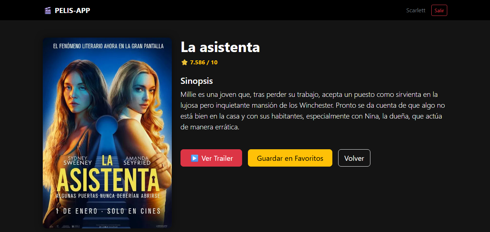
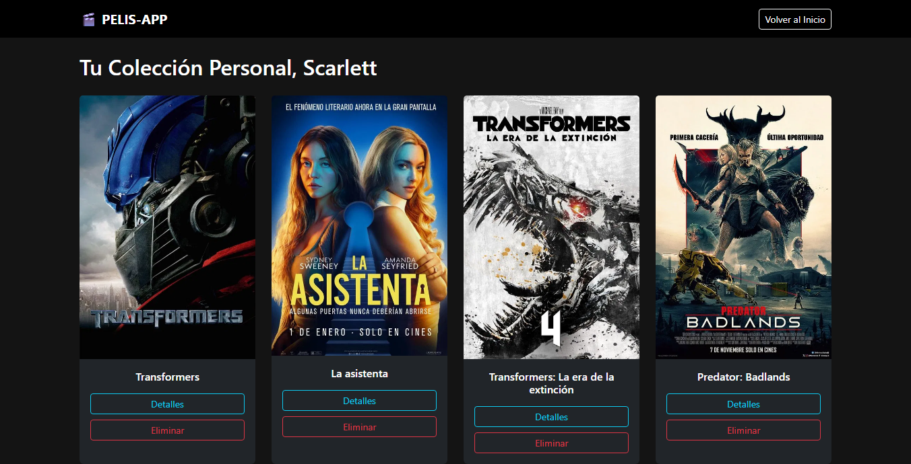

## WebPeliculas: Catálogo y Gestión de Favoritos

## Descripción
WebPeliculas es una aplicación Full Stack desarrollada con Java 21 y Spring Boot 4.0.1. La plataforma permite a los usuarios registrarse, explorar tendencias de cine y series mediante la integración con la API de TMDB, y gestionar una lista personalizada de favoritos almacenada en una base de datos.

## Funcionalidades:

Autenticación de Usuarios: Registro e inicio de sesión de usuarios gestionado con Spring Security.

Consumo de API REST: Visualización de películas y series consumiendo datos en vivo desde una API externa TMDB.

Buscador y Filtros: Búsqueda dinámica de contenidos.

Gestión de Favoritos: Persistencia de datos para añadir y eliminar películas de una lista privada por usuario.

Detalles Extendidos: Vistas detalladas para películas y series, incluyendo información técnica y multimedia (trailers).

## Galeria del Proyecto
| Registrarse (Sign up) | Iniciar Sesión (Login)  |
| :---: | :---: |
|  |  |

| Búsqueda de Películas | Detalles | Mis Favoritos |
| :---: | :---: |
|  |   |

## Tecnologías y Herramientas:

* **Backend:** Java 21, Spring Boot, Maven.

* **Frontend:** Thymeleaf, HTML5, CSS3.

* **Base de Datos:** MySQL (conectado vía mysql-connector-j).

* **Seguridad:** Spring Security 6.

* **Mapeo de Datos:** DTOs personalizados para estructurar respuestas de la API.

* **Productividad:** Lombok para la reducción de código boilerplate.

## Estructura del Proyecto:

* **model:** Entidades JPA (Usuario, PeliculaFavorita).

* **repository:** Interfaces de acceso a datos con Spring Data JPA.

* **service:** Lógica de negocio y comunicación con la API externa (MovieService).

* **controller:** Gestión de rutas web y autenticación (AuthController, MovieController).

* **dto:** Objetos de transferencia para procesar JSON de películas, series y videos.

* **config:** Configuraciones de seguridad y beans de la aplicación.

* **templates:** Vistas dinámicas creadas con Thymeleaf (Login, Registro, Favoritos, etc.).

## Instalación y Configuración:

* **Requisitos previos**
Java 21 o superior.
MySQL Server.
Una API Key de The Movie Database (TMDB).